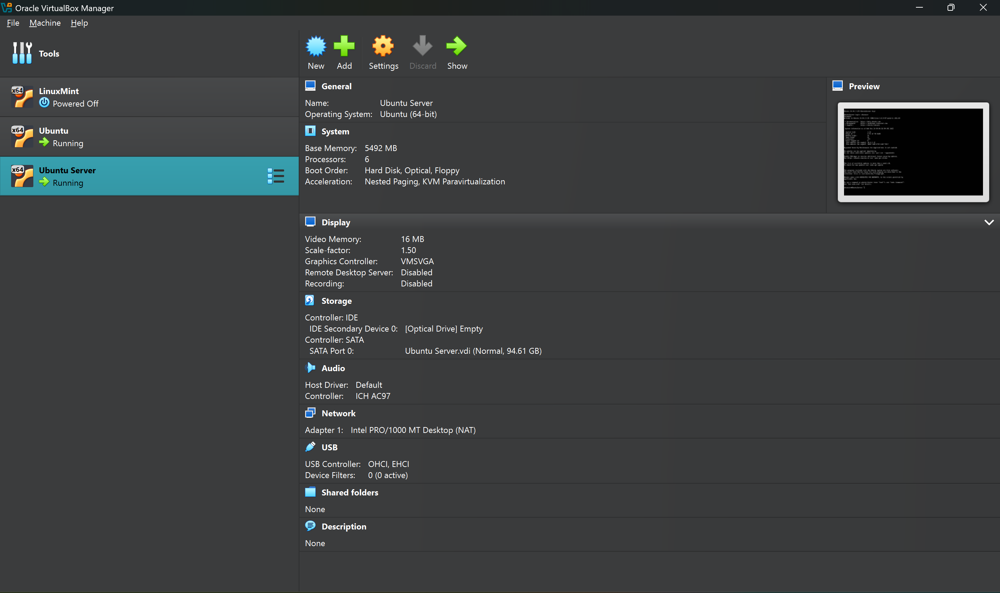

# Week 1 – System Planning & Distribution Selection

---

## Introduction

This week focused on designing and planning the operating system environment required for the Operating Systems coursework.  
The objective was to create a **stable, secure, and realistic Linux-based virtual server environment** that supports later coursework activities such as remote administration, security hardening, monitoring, and performance evaluation.

A **virtualised architecture** was selected to allow safe experimentation without impacting the host system while reflecting professional real-world server deployment practices.

---

## System Architecture Overview

The planned system consists of two primary components:

- **Ubuntu Server (CLI-based)**  
  Acts as the main server responsible for system configuration, security implementation, monitoring, and performance testing.  
  All administrative tasks are performed remotely using **SSH**.

- **Workstation (Host System)**  
  Used to remotely connect to and manage the server through Secure Shell (SSH).

This design enforces command-line proficiency and mirrors modern enterprise server administration, where servers are managed remotely rather than locally.

---

## System Planning Flow

The following structured planning process was followed:

1. Analyse coursework requirements  
2. Select virtualisation platform (Oracle VirtualBox)  
3. Choose an appropriate Linux server distribution  
4. Configure a minimal server installation (CLI only)  
5. Design secure network connectivity  
6. Verify system readiness using command-line tools  

This systematic approach ensures the environment is prepared for future security, monitoring, and performance tasks.

---

## Distribution Selection Justification

### Selected Distribution: **Ubuntu Server 24.04 LTS**

Ubuntu Server 24.04 LTS was chosen based on the following advantages:

- **Long-Term Support (LTS)**  
  Provides long-term stability and security updates essential for server environments.

- **Extensive documentation and community support**  
  Enables efficient troubleshooting and learning in both academic and professional contexts.

- **Wide package availability**  
  Supports easy installation of required services such as SSH, firewall utilities, monitoring tools, and security scanners.

- **Strong VirtualBox compatibility**  
  Ensures reliable performance within a virtualised environment without additional configuration complexity.

---

## Virtual Machine Creation

This screenshot confirms the successful creation of the Ubuntu Server virtual machine in Oracle VirtualBox with the allocated CPU, memory, and storage resources.

---

## Distribution Comparison Table

| Distribution | Stability | Documentation | VirtualBox Support | Decision |
|------------|-----------|---------------|-------------------|---------|
| Ubuntu Server 24.04 LTS | Very High | Excellent | Excellent | ✅ Selected |
| Debian | Very High | Moderate | Good | Not chosen |
| Fedora Server | Medium | Moderate | Good | Not chosen |
| CentOS Stream | High | Limited | Moderate | Not chosen |

Ubuntu Server was selected due to its optimal balance between stability, usability, and suitability for academic and real-world server deployments.

---

## Virtual Machine Configuration

| Component | Configuration |
|---------|---------------|
| Operating System | Ubuntu Server 24.04 LTS |
| Memory | 5 GB |
| CPU | 2 vCPUs |
| Storage | 93 GB |
| Interface | Command Line (No GUI) |

### Headless Server Design Decision

A minimal, headless server installation was intentionally chosen to:

- Reduce system resource usage  
- Minimise the attack surface  
- Improve security and performance  

This configuration follows professional server best practices.

---

## Network Configuration Planning

The server was configured using **NAT networking**.

This design was selected because it:

- Allows internet access for system updates  
- Provides a secure default configuration  
- Reduces direct exposure of the server to external networks  

### Network Design Trade-off

Although NAT limits direct inbound access, this is acceptable for this coursework because server management is performed via SSH from the workstation and security is prioritised over public accessibility.

---

## Initial System Verification

Initial verification was performed to ensure the server was operational and ready for remote administration.

Key checks included:

- Confirming kernel and OS version  
- Verifying memory and disk allocation  
- Checking active network interfaces and assigned IP address  

---

### SSH Service Verification

This screenshot confirms that the SSH service is **active and running**, enabling secure remote administration without reliance on the VirtualBox console.

---

### SSH Network Port Verification

This screenshot confirms that the SSH service is listening on the correct network port, validating readiness for secure remote connectivity.

---

## Week 1 Requirement Checklist

| Requirement | Status |
|------------|--------|
| System architecture planning | ✅ Completed |
| Distribution selection and justification | ✅ Completed |
| Virtualisation platform selection | ✅ Completed |
| Network configuration planning | ✅ Completed |
| Initial system verification | ✅ Completed |
| Supporting evidence prepared | ✅ Completed |

---

## Reflection

This week demonstrated that strong system planning is essential before technical implementation.  
Early design decisions regarding operating system choice, architecture, and network configuration directly affect long-term security, performance, and maintainability.

Building a minimal Ubuntu Server environment reinforced core Linux administration principles and established a robust foundation for the advanced security, monitoring, and performance evaluation tasks in subsequent weeks.

---

### 🔗 Navigation

[Back to Index](index.md) | Week 1 | [Week 2](Week2.md) | [Week 3](Week3.md) | [Week 4](Week4.md) | [Week 5](Week5.md) | [Week 6](Week6.md) | [Week 7](Week7.md)
