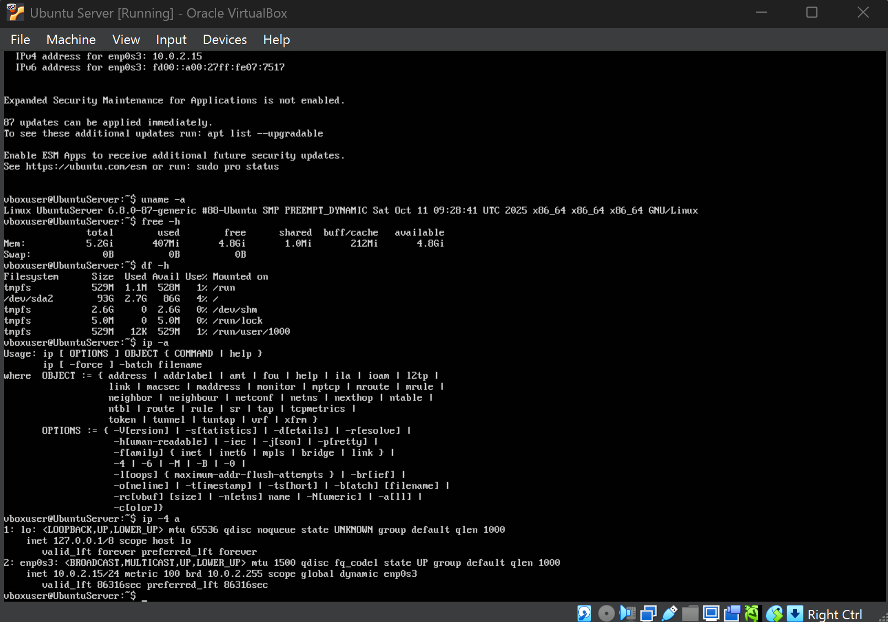
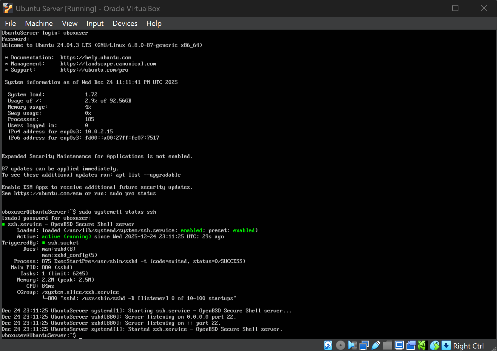

# Week 1 – System Planning & Distribution Selection

---

## 1. Introduction

Week 1 focused on planning and preparing the operating system environment for the Operating Systems coursework.  
The goal was to build a **stable, secure, CLI-only Ubuntu Server** inside **Oracle VirtualBox**, ready for later weeks that require **remote administration via SSH**, security hardening, monitoring, and performance evaluation.

A virtualised approach was selected to allow controlled testing and iteration without affecting the host system while still reflecting real-world server deployment practices.

---

## 2. System Architecture Overview

The planned environment consists of two main components:

- **Ubuntu Server (Headless / CLI-based)**  
  A minimal server installation used for configuration, security implementation, monitoring, and performance testing.

- **Workstation (Host machine)**  
  Used to administer the server remotely using **SSH**, reflecting professional server administration practice.

This design ensures all tasks are performed using command-line tools and remote access, aligning with the coursework constraints.

---

## 3. Planning Flow

The following structured planning process was followed:

1. Review coursework requirements and constraints  
2. Select a virtualisation platform (Oracle VirtualBox)  
3. Choose a suitable Linux server distribution  
4. Configure a minimal CLI-only server installation  
5. Select and document network configuration  
6. Verify baseline server readiness using CLI system checks  

---

## 4. Distribution Selection Justification

### Selected Distribution: Ubuntu Server 24.04 LTS

Ubuntu Server 24.04 LTS was selected due to:

- **Long-Term Support (LTS)** for stability and predictable updates
- Strong documentation and community support for troubleshooting
- Wide package availability for SSH, firewall tooling, monitoring, and security auditing
- Reliable performance and compatibility within VirtualBox

---

## 5. Virtual Machine Creation (Oracle VirtualBox)

The Ubuntu Server VM was created in Oracle VirtualBox with a practical configuration suitable for later security and performance testing.

---

## 6. Distribution Comparison Table

| Distribution | Stability | Documentation | VirtualBox Support | Decision |
|------------|-----------|---------------|-------------------|---------|
| Ubuntu Server 24.04 LTS | Very High | Excellent | Excellent | ✅ Selected |
| Debian | Very High | Moderate | Good | Not chosen |
| Fedora Server | Medium | Moderate | Good | Not chosen |
| CentOS Stream | High | Limited | Moderate | Not chosen |

Ubuntu was selected due to the best overall balance between stability, usability, and suitability for both coursework and industry practice.

---

## 7. Virtual Machine Configuration

| Component | Configuration |
|---------|---------------|
| Operating System | Ubuntu Server 24.04 LTS |
| Memory | ~5 GB |
| CPU | 2 vCPUs |
| Storage | ~93–94 GB |
| Interface | CLI-only (No GUI) |
| Network | NAT |

### Headless Design Decision

A headless (CLI-only) server was chosen to:
- Reduce resource usage
- Minimise attack surface
- Improve operational realism for remote server administration

---

## 8. Network Configuration Planning

The VM was configured using **NAT networking**, providing:
- Internet access for updates and package installation
- A secure default boundary between the VM and external networks
- Controlled inbound exposure (useful for a security-focused coursework environment)

---

## 9. Initial System Verification (CLI Evidence)

Baseline verification was performed to confirm the server was operational and correctly configured for later tasks.

The following command-line checks were used:
- Kernel and OS validation
- Memory status verification
- Disk allocation verification
- Network interface and IPv4 address identification

---

## 10. SSH Service Verification

SSH was confirmed to be installed, enabled, and running so that administration can be performed remotely (as required for later weeks).

- Service status confirmed using `systemctl status ssh`
- Port listening confirmed using `ss -tlnp | grep ssh`

This validates that secure remote access is available and that the server is ready for Week 4+ hardening.

---

## 11. Week 1 Requirement Checklist

| Requirement | Status |
|------------|--------|
| System architecture planning | ✅ Completed |
| Distribution selection and justification | ✅ Completed |
| Virtualisation platform selection | ✅ Completed |
| VM creation and configuration evidence | ✅ Completed |
| Network configuration planning | ✅ Completed |
| Baseline CLI verification evidence | ✅ Completed |
| SSH readiness verified | ✅ Completed |

---

## 12. Reflection

Week 1 established a secure and realistic foundation for the coursework by ensuring a minimal headless Ubuntu Server environment was deployed successfully and verified using CLI system checks.

These early design decisions (distribution, architecture, network configuration, and SSH readiness) provide a stable base for future weeks that require stronger security controls, monitoring automation, and performance testing.

---

### 🔗 Navigation

[Back to Index](index.md) | Week 1 | [Week 2](Week2.md) | [Week 3](Week3.md) | [Week 4](Week4.md) | [Week 5](Week5.md) | [Week 6](Week6.md) | [Week 7](Week7.md)
