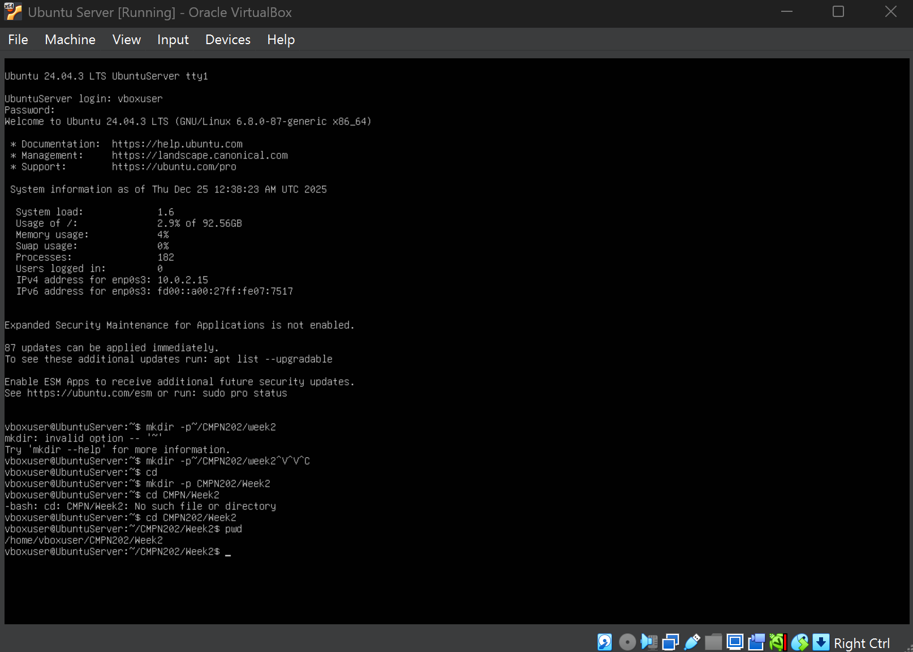
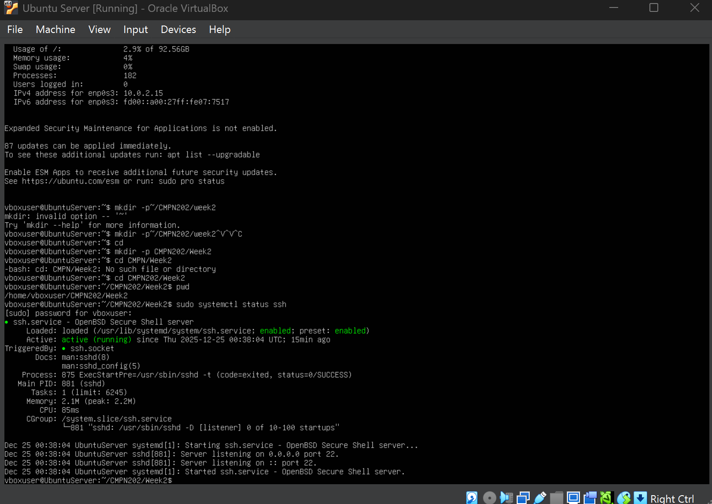
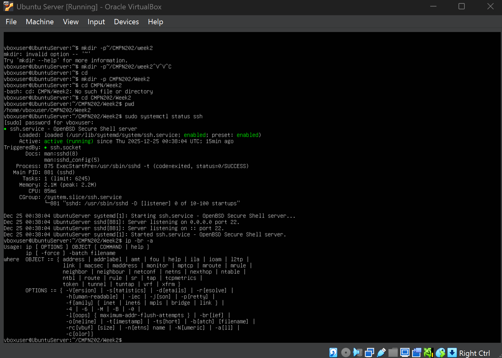
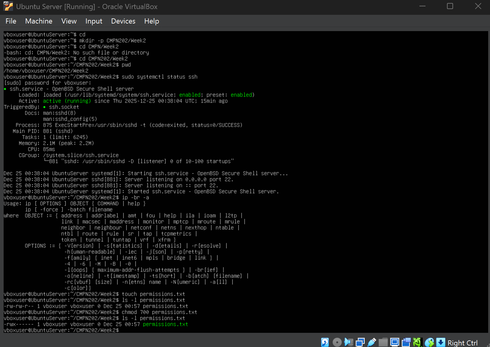
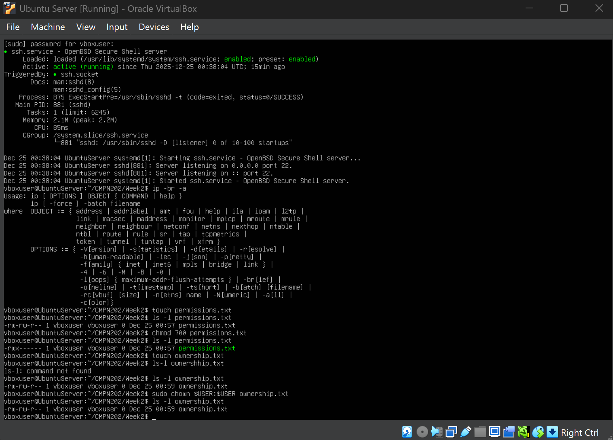
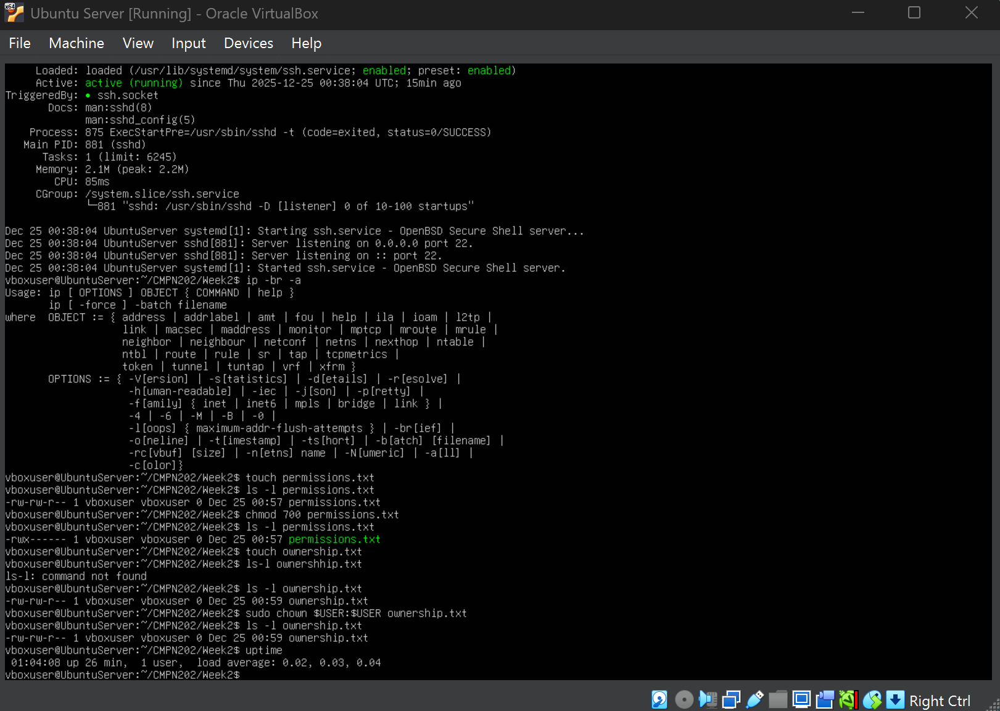
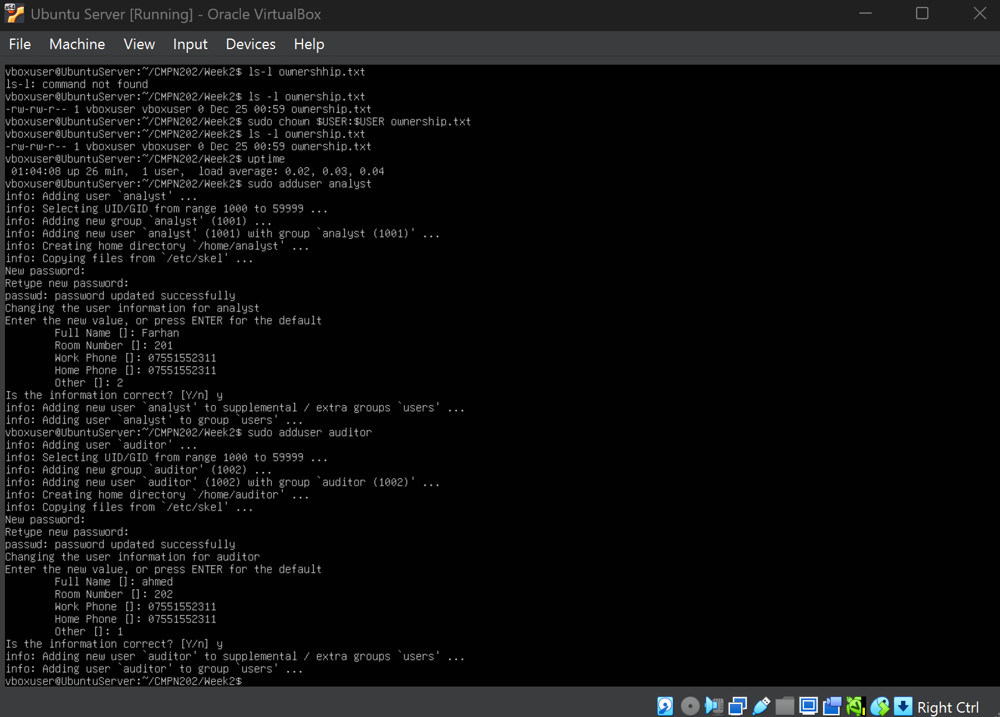
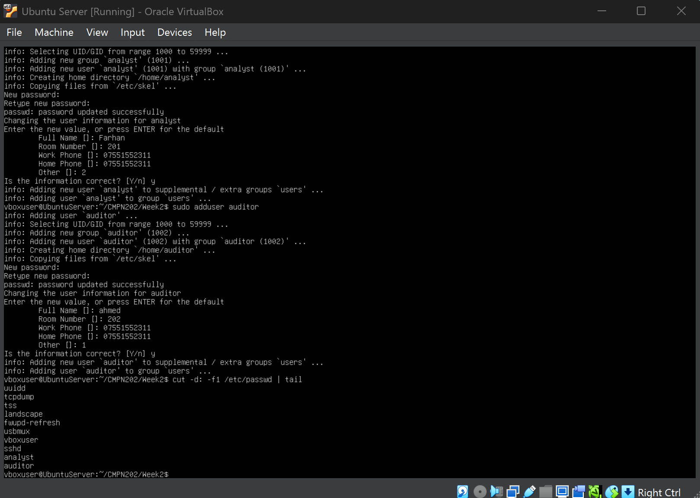
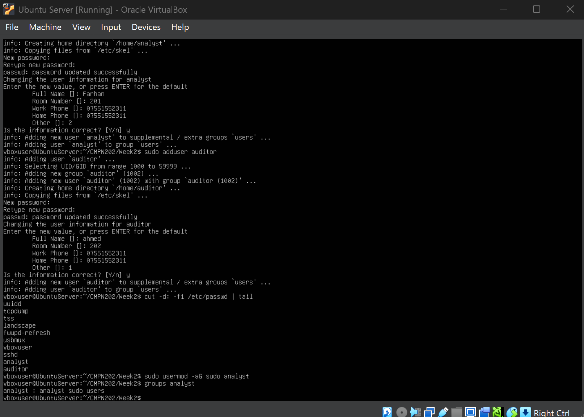
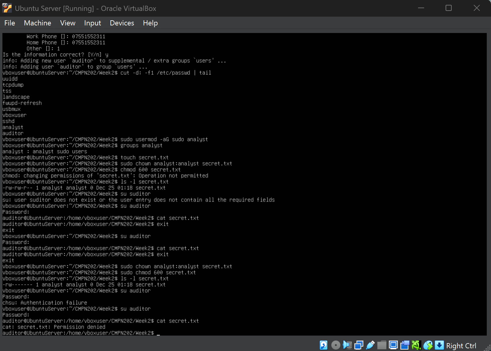

# Week 2 – Security Configuration, Remote Administration & Testing Methodology

---

## 1. Introduction

Week 2 focused on implementing secure remote administration while formally designing a security baseline and performance testing methodology for the server environment.  
The primary objective was to configure **secure SSH access**, validate network readiness, enforce **file permissions and ownership**, and establish structured security and monitoring practices.

---

## 2. Objectives for This Week

- Enable secure remote administration  
- Verify SSH service availability  
- Confirm correct network configuration  
- Implement file permission and ownership controls  
- Demonstrate user privilege separation  
- Define a security baseline and performance testing methodology  

---

## 3. Performance Testing Plan & Remote Monitoring Methodology

### 3.1 Testing Objectives

The performance testing methodology aims to:

- Establish baseline system behaviour  
- Detect abnormal resource usage  
- Measure system stability  
- Support later stress testing and optimisation  

### 3.2 Remote Monitoring Approach

All monitoring is performed remotely over SSH.

| Category | Tools |
|--------|------|
CPU Monitoring | `top`, `htop`, `ps` |
Memory Monitoring | `free`, `vmstat` |
Disk & I/O | `df`, `iostat` |
Process Analysis | `ps aux` |
Uptime & Load | `uptime`, `/proc/loadavg` |

Baseline values are recorded during idle operation for comparison in later phases.

---

## 4. Security Configuration Checklist

| Security Area | Implementation |
|--------------|---------------|
SSH Hardening | SSH enabled and verified |
Firewall | Planned for later phase (UFW) |
Mandatory Access Control | Planned using AppArmor |
Automatic Updates | Ubuntu unattended upgrades enabled |
User Privilege Management | `vboxuser`, `analyst`, `auditor` roles |
File Permissions | Enforced using `chmod` |
File Ownership | Enforced using `chown` |
Network Security | NAT networking used |
Unauthorized Access Control | Permission restrictions tested |

---

## 5. Threat Model & Mitigation Strategy

| Threat | Risk | Mitigation |
|------|------|-----------|
Brute Force SSH | Unauthorized login | Strong authentication, firewall (planned) |
Privilege Escalation | Abuse of admin rights | Limited sudo privileges |
Unauthorized Data Access | Data exposure | Strict permissions & ownership |

---

## 6. SSH Service Verification

Command used:

- `sudo systemctl status ssh`

---

## 7. Network Configuration Verification

Command used:

- `ip a`

---

## 8. File Permission Configuration

Commands used:

- `touch permissions.txt`  
- `chmod 700 permissions.txt`

---

## 9. File Ownership Enforcement

Commands used:

- `touch ownership.txt`  
- `sudo chown vboxuser:vboxuser ownership.txt`

---

## 10. User & Privilege Management

Commands used:

- `sudo adduser analyst`  
- `sudo adduser auditor`

Grant admin privileges:

- `sudo usermod -aG sudo analyst`  
- `groups analyst`

---

## 11. Confidential File Protection

Commands used:

- `touch secret.txt`  
- `sudo chown analyst:analyst secret.txt`  
- `sudo chmod 600 secret.txt`

---

## 12. Unauthorized Access Attempt

Commands used:

- `su auditor`  
- `cat secret.txt`

---

## 13. Authorized Access Confirmation

Commands used:

- `su analyst`  
- `cat secret.txt`

---

## 14. Security Evaluation Summary

| Area | Status |
|-----|------|
Remote Access | Secure |
User Privileges | Enforced |
File Permissions | Enforced |
File Ownership | Enforced |
Unauthorized Access | Blocked |
Security Baseline | Established |

---

## 15. Reflection

This week established a strong security baseline and testing framework by combining practical enforcement with structured planning.  
The system is now prepared for firewall deployment, intrusion detection, and performance evaluation in later phases.

---

### 🔗 Navigation

[Back to Index](index.md) | [Week 1](Week1.md) | **Week 2** | [Week 3](Week3.md) | [Week 4](Week4.md) | [Week 5](Week5.md) | [Week 6](Week6.md) | [Week 7](Week7.md)
