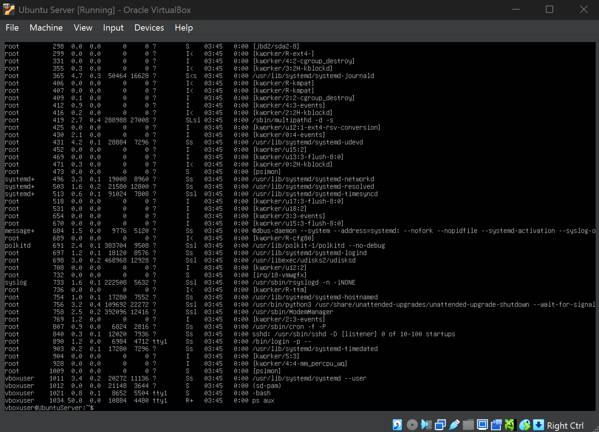
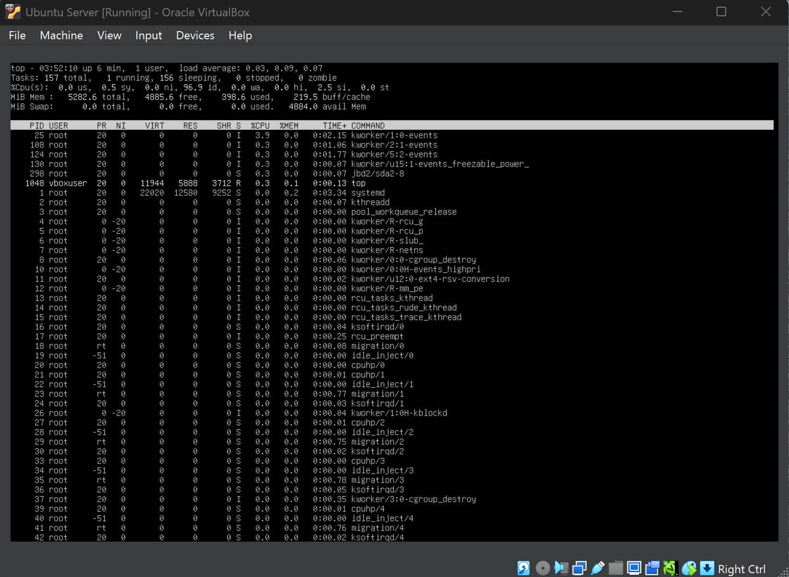
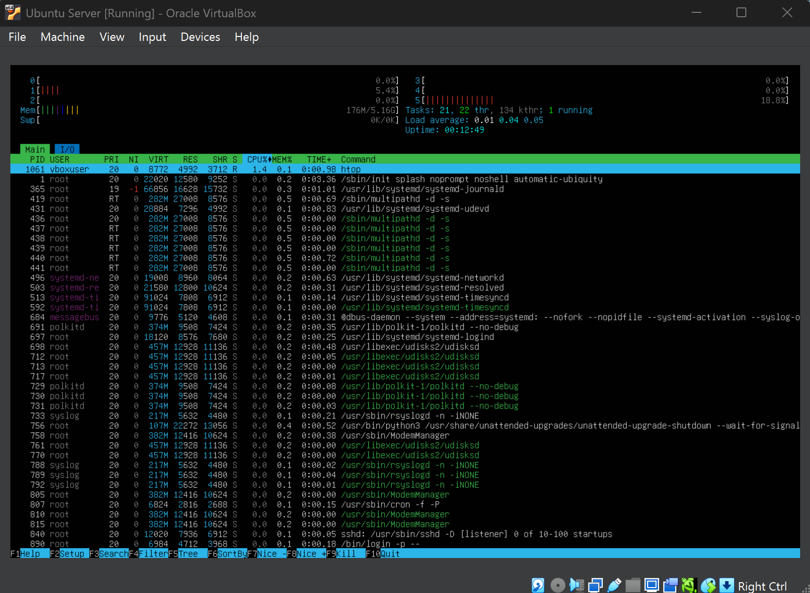
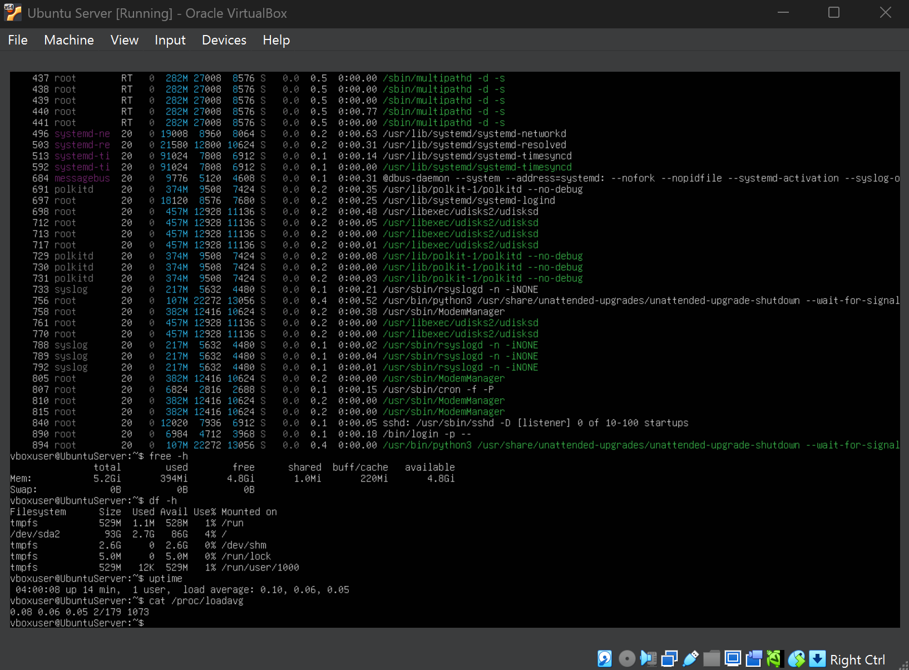

# 📊 Week 3 – Performance Testing & Monitoring

---

## 1. Introduction

Week 3 focused on evaluating the performance of the Linux server through real-time monitoring and process analysis.  
Rather than configuring new services, the goal was to understand how the operating system behaves under normal conditions and how system resources such as CPU and memory are utilised.

Performance testing is essential for detecting bottlenecks, ensuring stability, and preparing the system for future optimisation and security hardening.

---

## 2. Objectives for This Week

The objectives of Week 3 were:

- Monitor real-time system performance  
- Understand CPU and memory utilisation  
- Observe running processes and background services  
- Analyse overall system behaviour and stability  
- Prepare the environment for future tuning and optimisation tasks  

---

## 3. Performance Monitoring Overview

System monitoring allows administrators to answer critical operational questions:

- Is the system under heavy load?
- Which processes are consuming the most resources?
- Is the server operating within safe limits?

Linux provides several built-in monitoring tools that allow administrators to evaluate system health without installing additional software.

---

## 4. Process Monitoring Using `ps`

### Purpose

The `ps aux` command was used to display a detailed list of running processes along with their CPU and memory usage.

### Screenshot: Process List Output

This output shows active system services and user processes and how resources are distributed across the system.

---

## 5. Real-Time System Monitoring Using `top`

### Purpose

The `top` command provides a continuously updating overview of system performance, including CPU usage, memory consumption, load average, and process states.

### Screenshot: `top` Output

The display confirms that CPU usage remains low during idle operation and memory usage is stable.

---

## 6. Enhanced Monitoring Using `htop`

### Purpose

`htop` was used as an advanced monitoring tool to provide improved visibility and usability.

### Screenshot: `htop` Interface

This interface allows faster identification of system activity and resource distribution.

---

## 7. Memory & Disk Usage Analysis

Memory and storage were analysed to ensure sufficient available resources.

### Screenshot: Memory & Disk

This confirms the system has adequate memory and disk capacity for stable operation.

---

## 8. System Uptime & Load Evaluation

The system’s uptime and load averages were examined to assess long-term stability.

### Screenshot: Uptime & Load

These values confirm the system is operating efficiently with low workload pressure.

---

## 9. Performance Summary

| Resource | Observation |
|---------|------------|
| CPU | Low utilisation during idle state |
| Memory | Stable usage with sufficient free RAM |
| Disk | Adequate available storage |
| Load Average | Low, indicating healthy system |
| Overall Stability | Maintained during testing |

---

## 10. Key Learning Outcomes

- Improved understanding of performance metrics  
- Ability to monitor live system behaviour  
- Identification of resource-heavy processes  
- Evaluation of system stability and readiness  

---

## 11. Reflection

Week 3 demonstrated that continuous performance monitoring is essential for maintaining system health and preventing degradation.  
These tools provide administrators with the insight required to plan capacity, detect issues early, and prepare systems for increased workloads.

---

### 🔗 Navigation

[Back to Index](index.md) | [Week 1](Week1.md) | [Week 2](Week2.md) | **Week 3** | [Week 4](Week4.md) | [Week 5](Week5.md) | [Week 6](Week6.md) | [Week 7](Week7.md)
