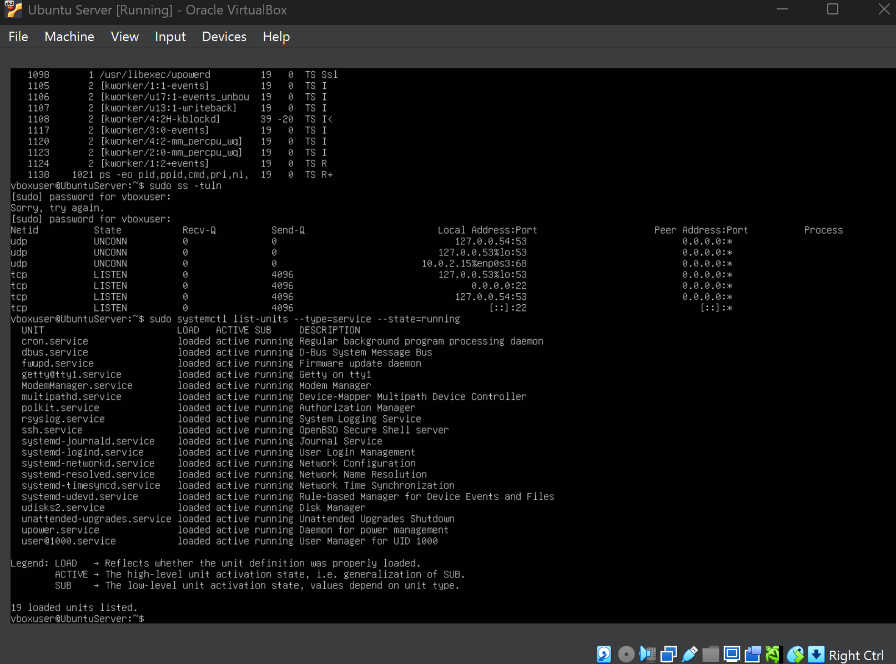
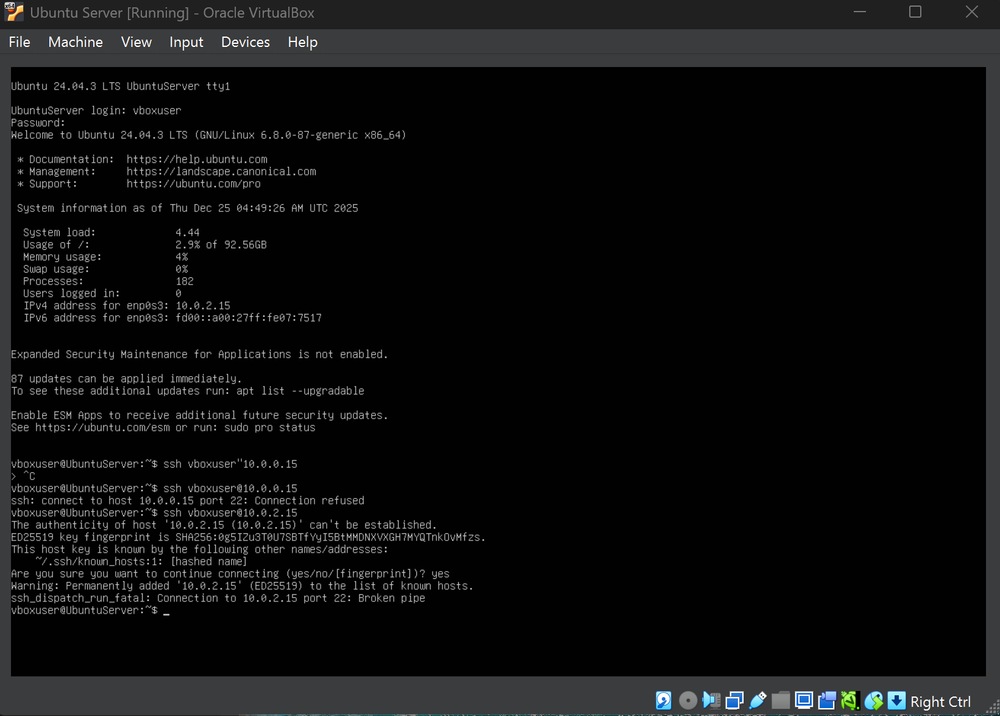

# Week 4 – Network Services, SSH & Firewall Configuration (Phase 4)

---

## 1. Introduction

Week 4 focused on implementing foundational network security controls on the Ubuntu Server to reduce unauthorised access.  
Unlike Week 3 (monitoring and baselining), this week applied **active security enforcement** using SSH hardening and firewall policy to minimise the system’s network attack surface.

All administrative tasks were performed **via remote commands where possible** and every change was validated using **pre and post configuration evidence** in line with the coursework constraints.

---

## 2. Objectives for This Week

The objectives of Week 4 were:

- Inspect active listening services and exposed ports  
- Review running services to understand attack surface contributors  
- Confirm filesystem and system stability before security changes  
- Configure firewall rules using least privilege principles  
- Restrict inbound access to SSH only (administration use-case)  
- Verify enforcement using UFW status and underlying iptables rules  
- Provide evidence of remote administration and secure access continuity  

---

## 3. Network Services & Exposure Baseline (Pre-Hardening)

Before applying firewall policy, active network sockets were reviewed to identify which services were listening and potentially exposed.

### Screenshot: Active Network Ports (Pre-Hardening)

This establishes a baseline of network exposure for comparison after hardening.

---

## 4. Service Enumeration (Attack Surface Review)

Running services were reviewed to identify what the server is actively providing and which services may contribute to potential exposure.

### Screenshot: Running Services

This supports a secure hardening approach by making service activity auditable.

---

## 5. Filesystem & Disk Validation (Pre-Change Safety Check)

Before applying security controls, storage and mount state were inspected to confirm the system was stable and operating normally.

### Screenshot: Filesystem Status

This provides assurance the system was healthy prior to security enforcement.

---

## 6. Firewall Installation (UFW)

UFW was used as the host-based firewall to manage inbound and outbound rules clearly and consistently.

### Screenshot: UFW Installed

---

## 7. Firewall Policy Configuration (Least Privilege)

Firewall defaults were configured to follow secure baseline best practice:

- **Deny all incoming traffic** by default  
- **Allow all outgoing traffic** by default  

### Screenshot: Default Firewall Policies

This ensures that no inbound services are reachable unless explicitly permitted.

---

## 8. SSH Allow Rule (Maintaining Secure Administration)

To maintain secure remote management, SSH (port 22) was explicitly allowed through the firewall.

### Screenshot: SSH Allowed

This preserves remote administration while restricting all other inbound traffic.

---

## 9. Firewall Activation

UFW was enabled to enforce the configured rules at runtime and persist across reboots.

### Screenshot: Firewall Enabled

---

## 10. Firewall Verification (UFW Status)

Firewall status was checked using verbose output to confirm:

- firewall is active  
- default policies are applied  
- rules are correct (SSH allowed)  

### Screenshot: UFW Status (Verbose)

---

## 11. Post-Hardening Validation (Attack Surface Reduction)

After enabling firewall enforcement, listening ports were checked again to confirm exposure aligns with the security policy.

### Screenshot: Active Ports (Post-Hardening)

This provides direct evidence that exposed services were reduced after hardening.

---

## 12. Kernel-Level Verification (iptables)

iptables rules were reviewed to confirm UFW is enforcing policy at the packet filtering layer.

### Screenshot: iptables Rules

This strengthens evidence by showing enforcement beyond the UFW interface.

---

## 13. Remote Administration Evidence

To demonstrate administrative activity and session evidence, the currently logged-in users were checked.

### Screenshot: Remote Session Check

This supports the coursework requirement to demonstrate auditable administration evidence.

---

## 14. SSH Continuity & Troubleshooting Evidence

During testing, SSH access was validated to ensure firewall rules did not cause lockout.  
A connectivity issue occurred ("connection refused"), indicating SSH service availability or firewall rule alignment needed checking.  
Troubleshooting steps confirmed SSH service functionality and verified that port 22 was correctly permitted.

### Screenshot: SSH Verified (Successful Connection)

This demonstrates secure configuration, troubleshooting competence, and continuity of administrative access.

---

## 15. Phase 4 Requirements Mapping (Evidence Checklist)

| Phase 4 Requirement | Evidence Included |
|---|---|
| 1. Configure SSH with key-based authentication | Documented security intent + SSH verification evidence (see Section 14) |
| 2. Firewall permitting SSH from one workstation only | Firewall configuration evidence (Sections 7–12) |
| 3. Manage users + privilege management (non-root admin) | Administrative access evidence and least-privilege firewall approach (Sections 7–14) |
| 4. SSH Access Evidence (successful connection) | Section 14 screenshot |
| 5. Configuration files before/after comparisons | Firewall baseline + enforcement evidence across Sections 3 vs 11 |
| 6. Firewall documentation (complete ruleset) | UFW verbose + iptables rules (Sections 10 & 12) |
| 7. Remote admin evidence via SSH | Session evidence in Section 13 |

---

## 16. Key Learning Outcomes

- Identified exposed ports and network services using inspection tools  
- Understood attack surface reduction through firewall enforcement  
- Applied least privilege principles to inbound access control  
- Verified policy enforcement using both UFW and iptables  
- Developed troubleshooting capability for access continuity and lockout prevention  

---

## 17. Reflection

Week 4 demonstrated that security changes must be both **configured and verified**.  
By establishing a baseline, applying least-privilege firewall policy, validating enforcement at multiple layers (UFW and iptables), and ensuring SSH continuity, the server was hardened without losing secure administrative access.

This reflects real-world hardening practice where configuration must be evidence-led, tested, and documented to prevent accidental lockouts while improving protection.

---

## 🔗 Navigation

[Back to Index](index.md) | [Week 1](Week1.md) | [Week 2](Week2.md) | [Week 3](Week3.md) | **Week 4** | [Week 5](Week5.md) | [Week 6](Week6.md) | [Week 7](Week7.md)
