#  Week 6 – Performance Evaluation and Analysis

---

## 1. Introduction

Week 6 focused on evaluating operating system performance under controlled workloads.  
The goal was to observe real system behaviour, identify bottlenecks, and test basic optimisation techniques.

---

## 2. Objectives

- Establish baseline performance
- Measure CPU, memory, disk, and network behaviour
- Identify system bottlenecks
- Apply and evaluate optimisation changes

---

## 3. Testing Methodology

Baseline measurement → Apply workload → Monitor resources → Capture evidence → Analyse results

---

## 4. Baseline State

System uptime was verified.

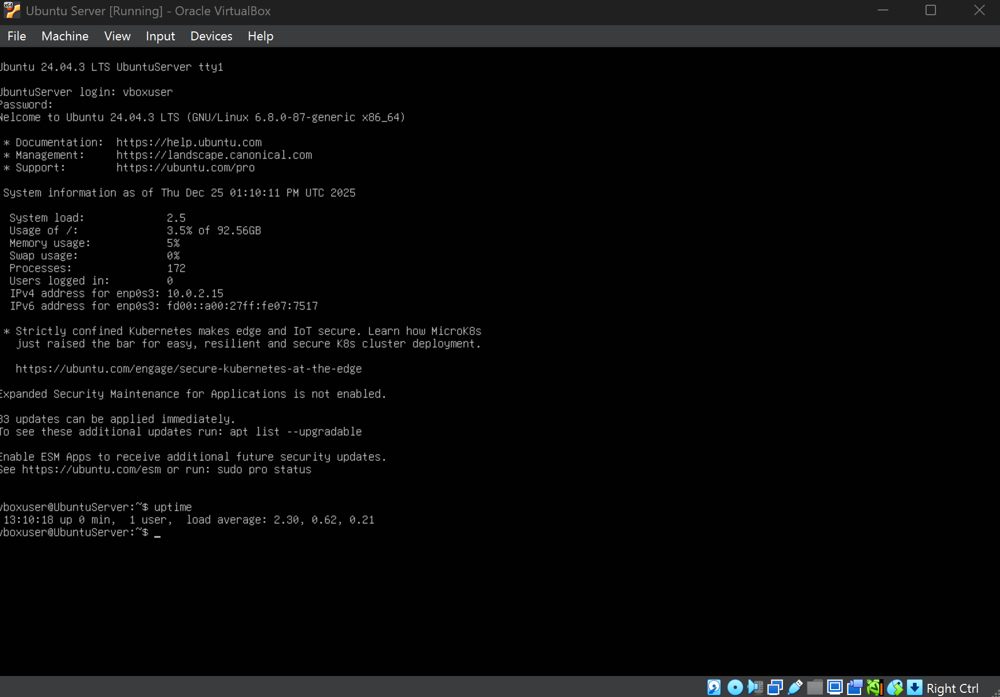

---

## 5. CPU Performance

### Idle

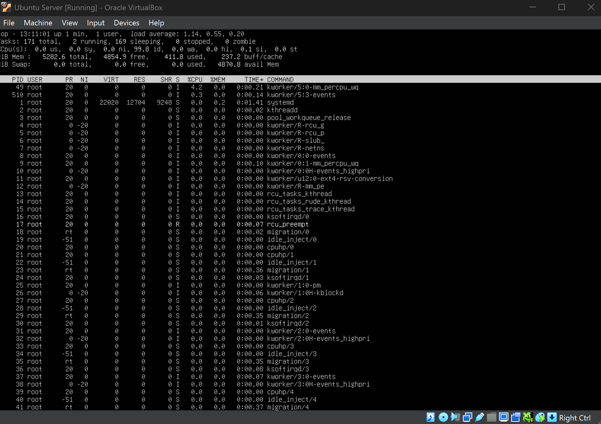

### Under Load

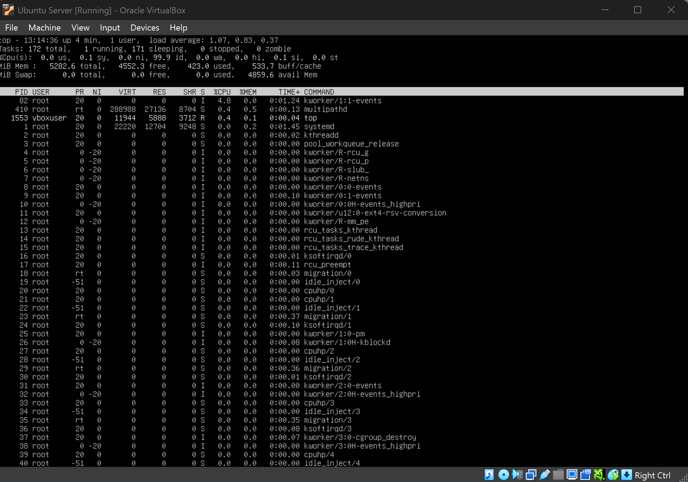

**Analysis:**  
CPU utilisation increased significantly under stress while remaining stable and responsive.

---

## 6. Memory Usage

### Idle

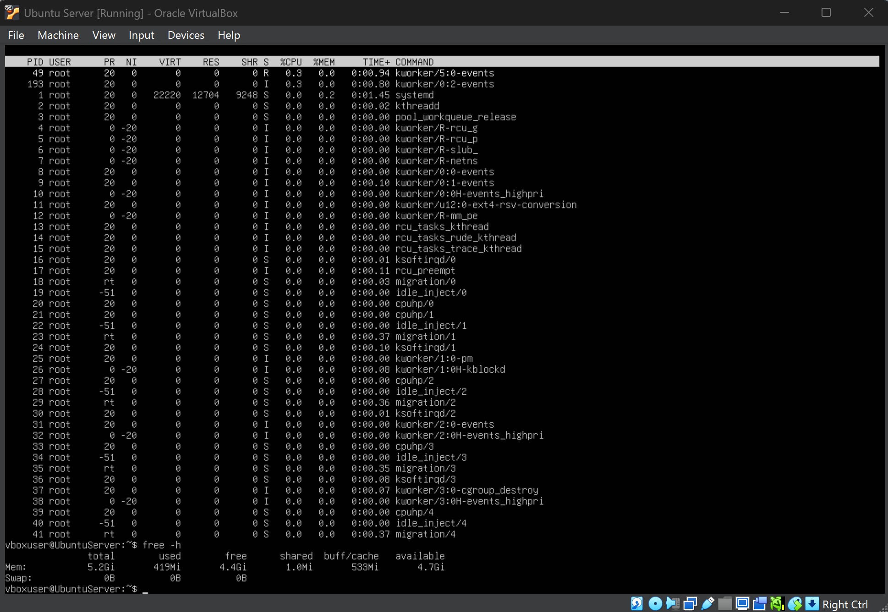

### Under Load

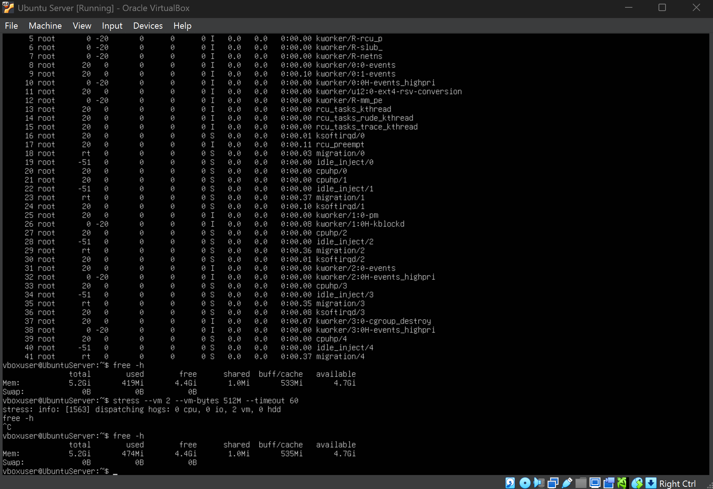

**Analysis:**  
Memory consumption increased appropriately with no swap exhaustion.

---

## 7. Disk I/O Performance

### Idle

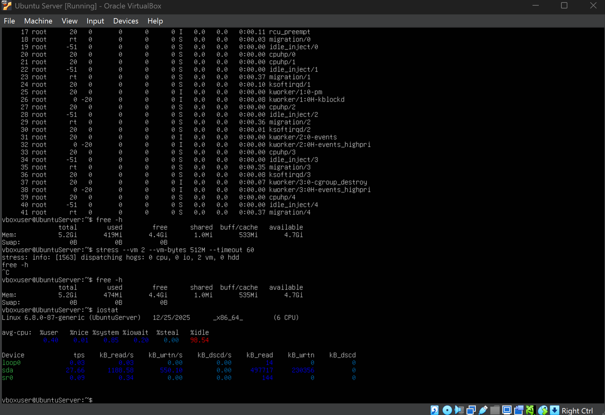

### Under Load

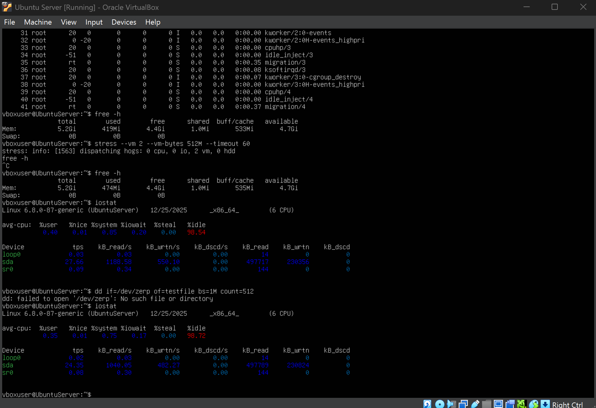

**Analysis:**  
Disk I/O experienced the greatest performance impact and became the primary bottleneck.

---

## 8. Network Performance

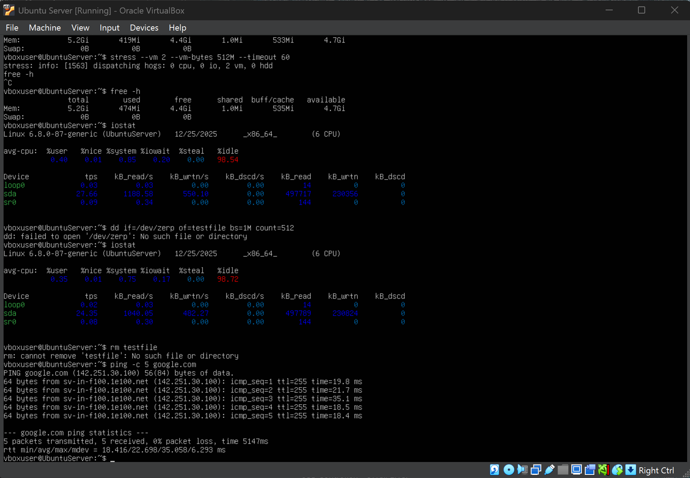

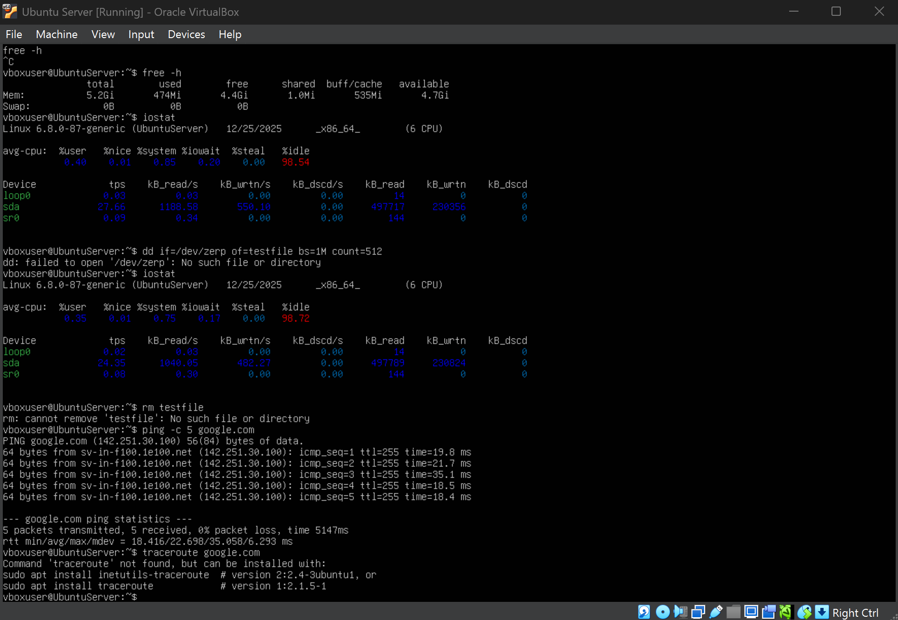

**Analysis:**  
Latency remained low with no packet loss, confirming reliable connectivity.

---

## 9. Performance Summary

| Metric | Baseline | Under Load |
|------|---------|-----------|
| CPU | Low | High |
| Memory | Stable | Increased |
| Disk | Minimal | Heavy |
| Network | Stable | Slight latency |

---

## 10. Bottleneck Identification

Primary bottleneck: **Disk I/O**

---

## 11. Optimisation Testing

Swappiness was reduced to improve memory handling.

### Before
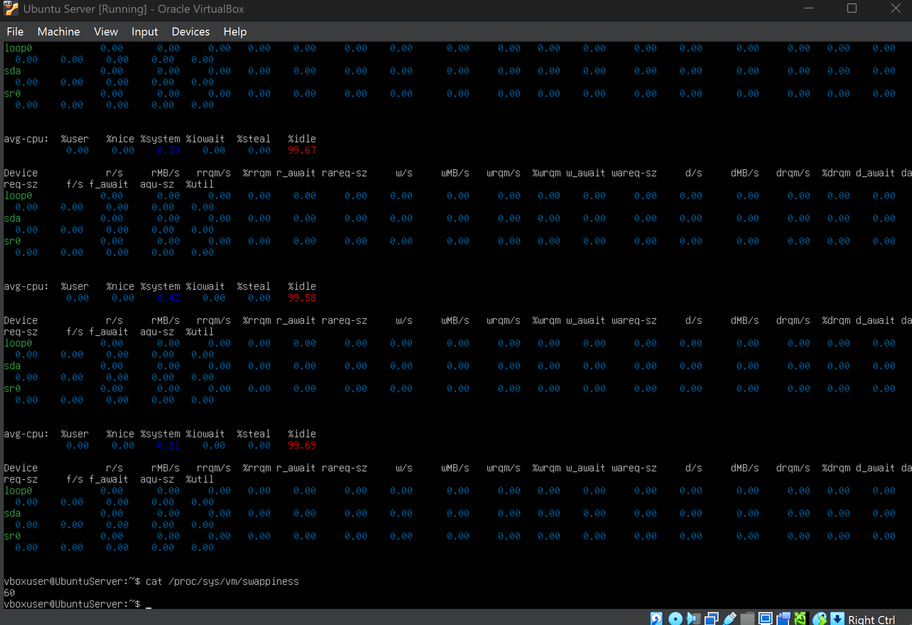

### After
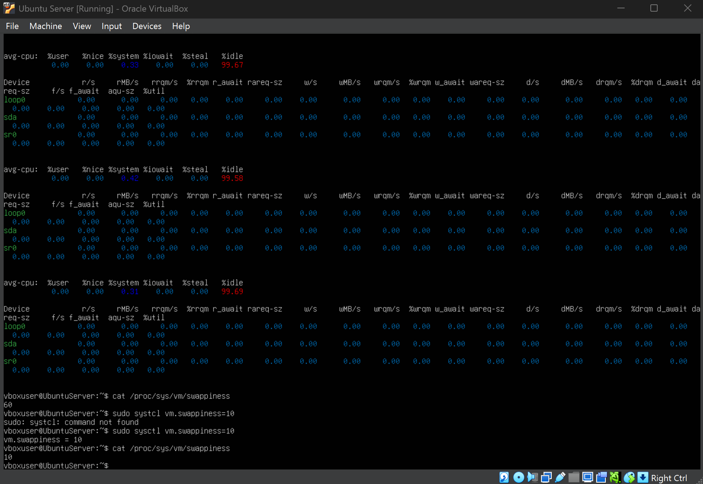

**Result:**  
Reduced swap tendency improved responsiveness under memory pressure.

---

## 12. Reflection

This week demonstrated how resource management directly affects system stability and performance.  
Structured monitoring enabled meaningful analysis and informed optimisation decisions.

---

[Back to Index](index.md) | [Week 1](Week1.md) | [Week 2](Week2.md) | [Week 3](Week3.md) | [Week 4](Week4.md) | [Week 5](Week5.md) | Week 6 | [Week 7](Week7.md)
