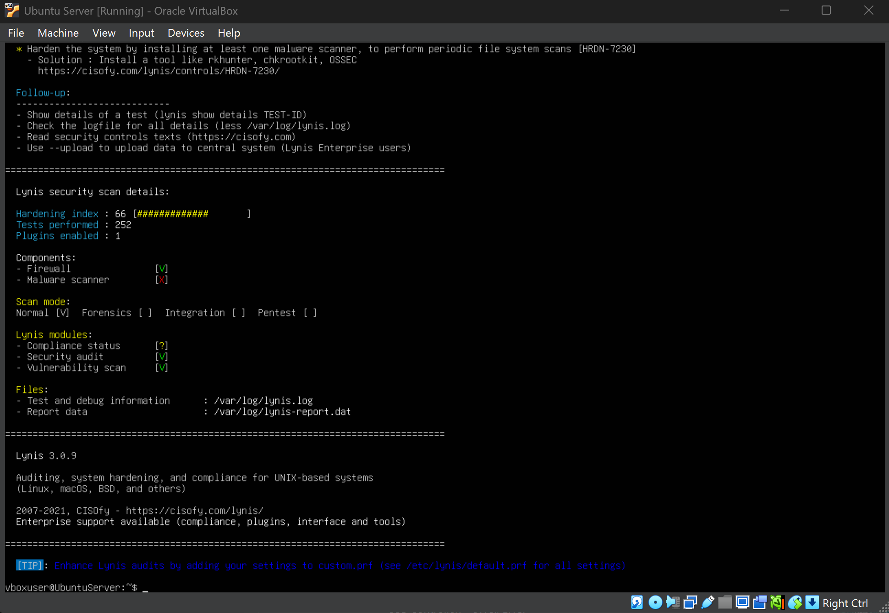
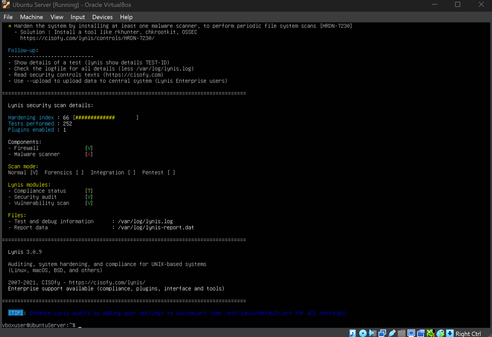
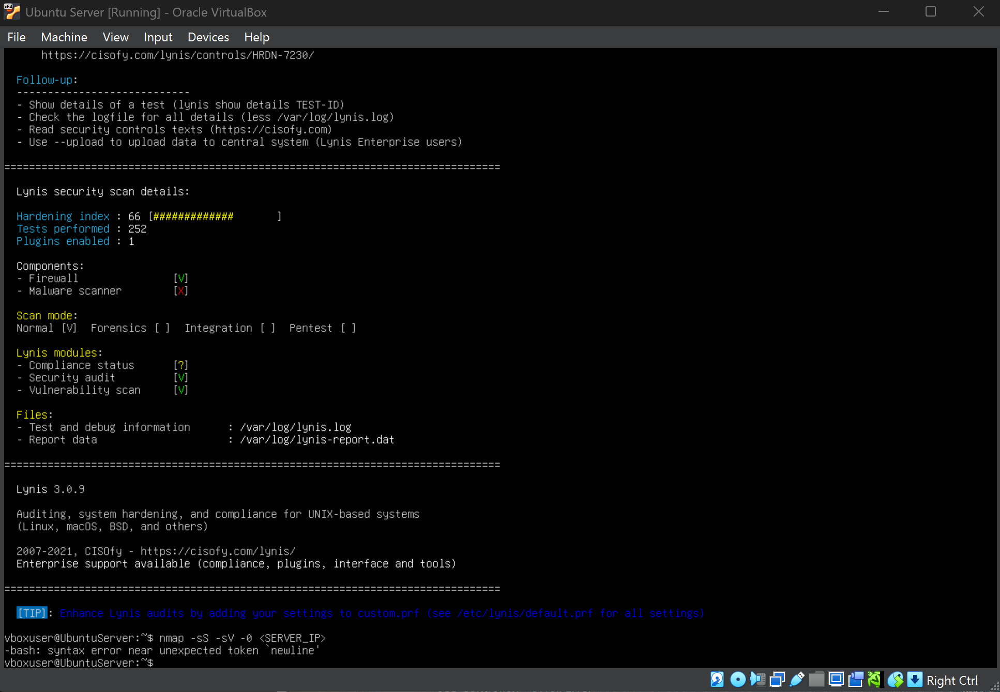
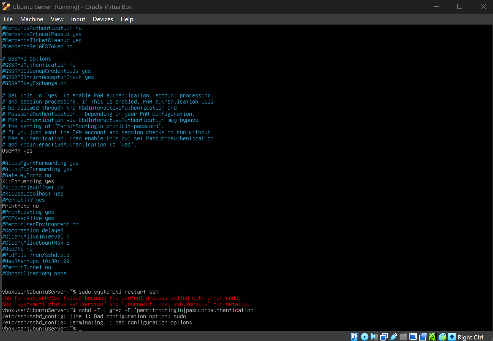
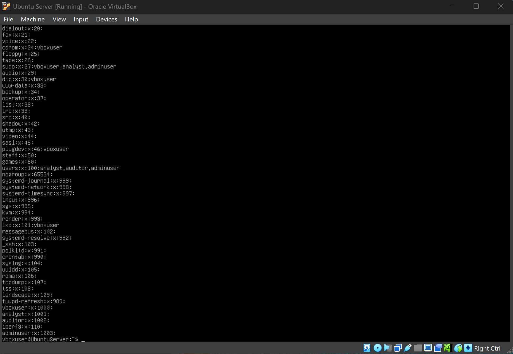
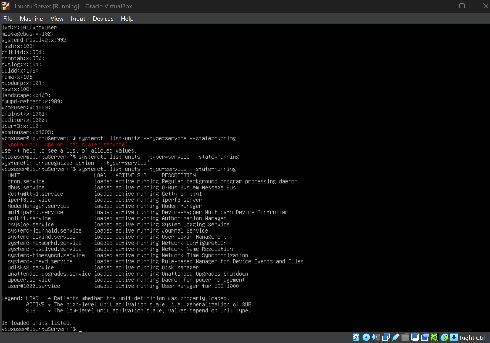
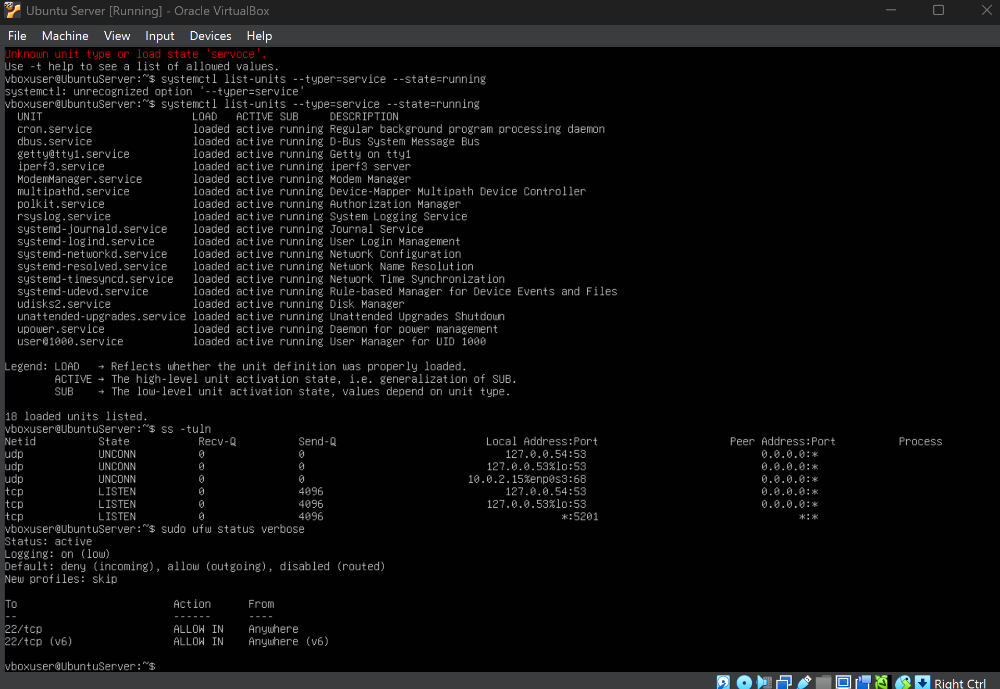

# 🛡️ Week 7 – Security Audit & System Evaluation

---

## 1. Introduction

Week 7 focused on conducting a comprehensive security audit of the operating system.  
The objective was to assess infrastructure security, identify vulnerabilities, implement remediation, and evaluate remaining risks.

---

## 2. Audit Methodology

Security Scan → Identify Issues → Apply Remediation → Re-scan → Evaluate Remaining Risks

---

## 3. Infrastructure Security Assessment (Lynis)

### Before Remediation

### After Remediation

**Analysis:**  
The system hardening index improved after applying security controls such as firewall activation and intrusion protection.

---

## 4. Network Security Testing

**Analysis:**  
Only essential services were exposed. No high-risk vulnerabilities were detected.

---

## 5. SSH Security Verification

Root login was disabled and SSH access remained restricted to authorised users.

---

## 6. Access Control Verification

User and group configurations were reviewed to confirm correct permission management.

---

## 7. Service Inventory & Justification

### Running Services

### Open Ports & Justification

Only necessary services such as SSH and system daemons were active.

---

## 8. Remaining Risk Assessment

Residual risk is minimal and acceptable for the current deployment scope.

---

## 9. Reflection

This security audit demonstrated how layered controls, continuous monitoring, and proactive remediation significantly improve system resilience.

---

[Back to Index](index.md)
[Back to Index](index.md) | [Week 1](Week1.md) | [Week 2](Week2.md) | [Week 3](Week3.md) | [Week 4](Week4.md) | [Week 5](Week5.md) | Week 6 | [Week 7](Week7.md)
